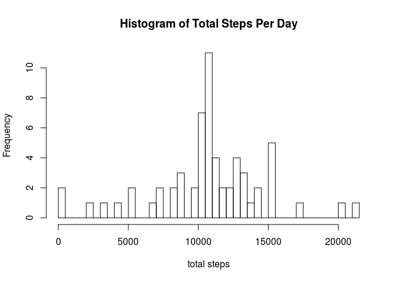
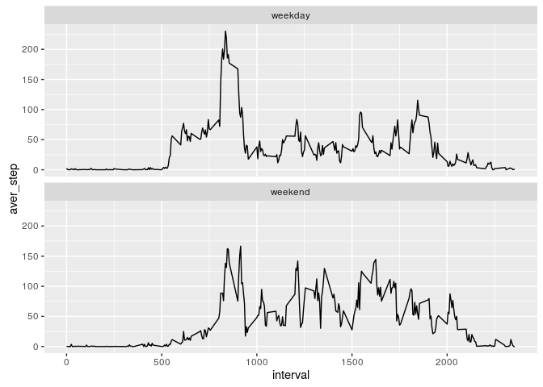

# Reproducible Research: Peer Assessment 1
## Preface
In this report, I explored and visualized some patterns of steps taken per day.

## Load library

```r
library(dplyr)
```

```
## 
## Attaching package: 'dplyr'
```

```
## The following objects are masked from 'package:stats':
## 
##     filter, lag
```

```
## The following objects are masked from 'package:base':
## 
##     intersect, setdiff, setequal, union
```

```r
library(ggplot2)
```


## Loading and preprocessing the data

```r
act <- read.csv("./activity.csv")
Act <- tbl_df(act)
```
Explore the dataset

```r
str(Act)
```

```
## Classes 'tbl_df', 'tbl' and 'data.frame':	17568 obs. of  3 variables:
##  $ steps   : int  NA NA NA NA NA NA NA NA NA NA ...
##  $ date    : Factor w/ 61 levels "2012-10-01","2012-10-02",..: 1 1 1 1 1 1 1 1 1 1 ...
##  $ interval: int  0 5 10 15 20 25 30 35 40 45 ...
```

```r
head(Act)
```

```
## Source: local data frame [6 x 3]
## 
##   steps       date interval
##   (int)     (fctr)    (int)
## 1    NA 2012-10-01        0
## 2    NA 2012-10-01        5
## 3    NA 2012-10-01       10
## 4    NA 2012-10-01       15
## 5    NA 2012-10-01       20
## 6    NA 2012-10-01       25
```

```r
summary(Act)
```

```
##      steps                date          interval     
##  Min.   :  0.00   2012-10-01:  288   Min.   :   0.0  
##  1st Qu.:  0.00   2012-10-02:  288   1st Qu.: 588.8  
##  Median :  0.00   2012-10-03:  288   Median :1177.5  
##  Mean   : 37.38   2012-10-04:  288   Mean   :1177.5  
##  3rd Qu.: 12.00   2012-10-05:  288   3rd Qu.:1766.2  
##  Max.   :806.00   2012-10-06:  288   Max.   :2355.0  
##  NA's   :2304     (Other)   :15840
```

## What is mean total number of steps taken per day?
### Creat tbl object for calculating the total steps per day
use sum function and group by date

```r
table <- Act %>%
  group_by(date) %>%
  summarise(total_step=sum(steps))

# explore table
table
```

```
## Source: local data frame [61 x 2]
## 
##          date total_step
##        (fctr)      (int)
## 1  2012-10-01         NA
## 2  2012-10-02        126
## 3  2012-10-03      11352
## 4  2012-10-04      12116
## 5  2012-10-05      13294
## 6  2012-10-06      15420
## 7  2012-10-07      11015
## 8  2012-10-08         NA
## 9  2012-10-09      12811
## 10 2012-10-10       9900
## ..        ...        ...
```

### Plot the histogram of the total steps taken each day
use base plot system  

```r
hist(table$total_step, breaks = 50, main = "Histogram of Total Steps Per Day",
     xlab = "total steps")
```


### Calculate the mean and median

```r
step_mean <- as.integer(mean(table$total_step, na.rm = TRUE))
step_median <- as.integer(median(table$total_step, na.rm = TRUE))
```
The mean of total steps taken per day is 10766, and the median is 10765.

## What is the average daily activity pattern?  
### Prepare table for average steps across days of every 5-min interval

```r
table2 <- Act %>%
group_by(interval) %>%
summarise(aver_step=mean(steps, na.rm=TRUE))
```

### Plot {daily activity pattern.

```r
qplot(interval, aver_step, data = table2, geom = "line")
```


### Find the interval with max steps taken.

```r
max_interval <- which.max(table2$aver_step)
```
the interval with max steps taken is the 104th(identifier: 835) interval.  

## Imputing missing values
### Count the NA values in the dataset

```r
count = sum(is.na(act$steps))
```
There is 2304 NA values in the dataset.  

### Find pattern of NA values

```r
head(table(act$interval, is.na(act$steps)))
```

```
##     
##      FALSE TRUE
##   0     53    8
##   5     53    8
##   10    53    8
##   15    53    8
##   20    53    8
##   25    53    8
```

```r
head(table(act$date, is.na(act$steps)))
```

```
##             
##              FALSE TRUE
##   2012-10-01     0  288
##   2012-10-02   288    0
##   2012-10-03   288    0
##   2012-10-04   288    0
##   2012-10-05   288    0
##   2012-10-06   288    0
```
So, the missing values are related to date.

### Use mean of 5-min interval to fill the NA values

```r
# find the date whose record is missed
missingdate <- unique(subset(act,is.na(act$steps))$date)

# replace missing values in new dataset
act2<-act
act2$steps = replace(act$steps, which(act$date %in% as.character(missingdate)),
rep(table2$aver_step, times = length(missingdate)))

# verify the replacement
summary(act2)
```

```
##      steps                date          interval     
##  Min.   :  0.00   2012-10-01:  288   Min.   :   0.0  
##  1st Qu.:  0.00   2012-10-02:  288   1st Qu.: 588.8  
##  Median :  0.00   2012-10-03:  288   Median :1177.5  
##  Mean   : 37.38   2012-10-04:  288   Mean   :1177.5  
##  3rd Qu.: 27.00   2012-10-05:  288   3rd Qu.:1766.2  
##  Max.   :806.00   2012-10-06:  288   Max.   :2355.0  
##                   (Other)   :15840
```

### Make histogram, calculate the new mean and median

```r
Act2 <- tbl_df(act2)

# prepare for plot and calculation
table3 <- Act2 %>%
  group_by(date) %>%
  summarise(total_step=sum(steps))

# plot histogram
hist(table3$total_step, breaks = 50, main = "Histogram of Total Steps Per Day",
     xlab = "total steps")
```



```r
step_mean2 <- as.integer(mean(table3$total_step))
step_median2 <- as.integer(median(table3$total_step))
```
The mean of total steps taken per day is 10766, and the median is 10766.   

### Coclusion
Compared with those with missing values included, it seems mean and median changed slightly, and the frequency is more likely normal distributed.

## Are there differences in activity patterns between weekdays and weekends?
### Find weekends in dates give

```r
dates<-as.character(unique(act$date))
weekends<-dates[weekdays(as.Date(dates)) == "星期日"| weekdays(as.Date(dates)) == "星期六"]
```
### Create new variables to identify weekdays and weekends

```r
Act2 <- mutate(Act2, weekday = (date %in% weekends))
Act2$weekday = factor(Act2$weekday, labels = c("weekday", "weekend"))
```
### Plot comparison between weekdays and weekends

```r
# prepare table
table4 <- Act2 %>%
group_by(interval, weekday) %>%
summarise(aver_step=mean(steps))

## make plot
g <- ggplot(data = table4)
g + geom_line(aes(x = interval, y = aver_step)) + facet_wrap(~weekday, nrow = 2)
```



### Conclusion
There are more steps taken in weekends than in weekdays.
